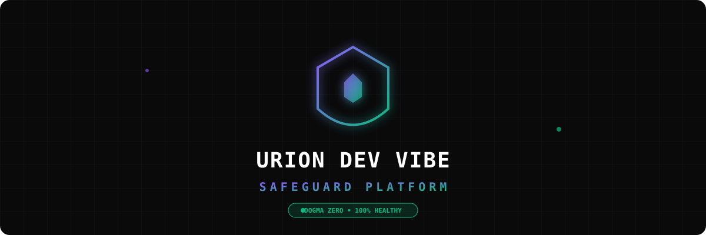

<!-- PROJECT SHIELDS & BADGES -->
<div align="center">

  <a href="https://urion.ia.br">
    
  </a>

  <h1 align="center">🛡️ Urion Trust & Safety for Creators</h1>

  <p align="center">
    <strong>A Camada de Confiança Definitiva para Software Gerado por IA, Vibe Coding, No-Code e Low-Code.</strong>
    <br />
    <em>Publique com a certeza de um engenheiro sênior, mesmo sem ser um.</em>
    <br />
    <br />
    <a href="https://urion.ia.br"><strong>🚀 Acessar Plataforma & Dashboard Ao Vivo »</strong></a>
    <br />
    <br />
    <a href="#-quick-start-em-30-segundos">Início Rápido</a>
    ·
    <a href="#-recursos-principais--cobertura">Recursos & No-Code</a>
    ·
    <a href="#-quality-gate-webhook-vercel--netlify">Quality Gate Webhook</a>
    ·
    <a href="https://github.com/joaoschaun33-cloud/Urion-Dev-Vibe-Coding-Safeguard/issues">Reportar Bug</a>
  </p>

  <!-- README TYPING ANIMATED SVG HEADER -->
  <p align="center">
    <a href="https://urion.ia.br">
      
    </a>
  </p>

  <!-- BADGES -->
  <p align="center">
    <a href="https://github.com/joaoschaun33-cloud/Urion-Dev-Vibe-Coding-Safeguard">
      
    </a>
    <a href="https://github.com/joaoschaun33-cloud/Urion-Dev-Vibe-Coding-Safeguard/actions/workflows/vibe-safeguard-bot.yml">
      
    </a>
    <a href="https://github.com/joaoschaun33-cloud/Urion-Dev-Vibe-Coding-Safeguard/actions">
      
    </a>
    <a href="https://opensource.org/licenses/MIT">
      
    </a>
    <a href="https://nodejs.org">
      
    </a>
    <a href="https://react.dev">
      
    </a>
    <a href="https://n8n.io">
      
    </a>
  </p>
</div>

---

## 📺 Dashboard & Selo Público Urion Verified

> **O problema:** 85% dos projetos criados apenas com prompts de IA (Cursor, Antigravity, Windsurf) colapsam no 2º mês por falta de arquitetura e segredos expostos, gerando descredibilização de mercado para makers e solopreneurs.

<div align="center">
  <a href="https://urion.ia.br">
    
  </a>
  <p align="center" style="margin-top: 8px;">
    <sub>💡 <i>Exiba a badge pública auditável <strong>Urion Verified</strong> no rodapé do seu app para comprovar a qualidade do projeto a clientes e investidores.</i></sub>
  </p>
</div>

---

## ⚡ Quick Start em 30 Segundos (Zero-Docker)

Inicialize um novo projeto 100% blindado com a nossa CLI interativa em **1 único comando**:

```bash
# Executar a CLI interativa (v2.0) em qualquer projeto
npx urion-safeguard

# Ou subcomandos diretos
npx urion-safeguard scanner   # Raio-X completo e Health Score (0-100%)
npx urion-safeguard blueprint # Transmitir blueprint anonimizado (SHA-256)
npx urion-safeguard rules     # Verificar regras MDC (.cursor/rules/)
```

Ou rode o repositório localmente em 3 passos simples (sem necessidade de Docker):

```bash
# 1. Clonar o repositório oficial
git clone https://github.com/joaoschaun33-cloud/Urion-Dev-Vibe-Coding-Safeguard.git && cd Urion-Dev-Vibe-Coding-Safeguard

# 2. Instalar dependências e preparar o banco local (SQLite)
npm install && npx prisma db push

# 3. Executar o Doctor CLI e o Dashboard Web
npm run cursor-doctor
npm run dev:web
```

- 🌐 **Dashboard Web**: http://localhost:5173
- 🔌 **API REST Backend**: http://localhost:3000/api/v1/health

> 💡 _Nota para Produção:_ O uso de PostgreSQL/Docker-Compose (`docker-compose up -d`) é **opcional** e recomendado apenas para ambientes de homologação e produção enterprise.

---

## 🧩 Recursos Principais & Cobertura

### 1. Suporte a Artefatos No-Code & Low-Code (`NoCodeArtifactScanner`)

O Urion varre não apenas código tradicional (JS/TS, Python), mas também estruturas declarativas e automações visuais:

- ⚡ **Workflows do n8n:** Detecta chaves de API e segredos hardcoded em nós de automação.
- 🔄 **Blueprints do Make.com:** Identifica tokens de autenticação expostos no fluxo.
- 📜 **OpenAPI / Swagger Specs:** Valida se os endpoints possuem autenticação global (`security`) configurada.
- 📦 **YAML / JSON Configs:** Varre arquivos de implantação Docker-Compose e CI/CD.

### 2. Quality Gate Webhook (Vercel / Netlify / Railway)

Intercepta o deploy em plataformas de hospedagem e aplica o **Quality Gate**:

- Endpoint: `POST /webhooks/deploy-quality-gate`
- Retorna **`HTTP 200 (APPROVED)`** para deploys limpos ou **`HTTP 422 (REJECTED)`** para barrar implantações inseguras em produção.

### 3. GitHub Action Bot (PR Feedback Empático)

Robô integrado ao GitHub (`.github/workflows/vibe-safeguard-bot.yml`) que analisa Pull Requests e comenta relatórios didáticos com tom amigável para vibe coders.

---

## 🧪 Exemplos Práticos

### 1. Gerar uma Nova Feature Isolada (FSD Auto-Wired)

Em vez de deixar a IA misturar rotas com banco de dados, use o scaffold CLI:

```bash
npm run generate:feature checkout
```

_Gera as camadas `domain`, `application`, `infrastructure`, `presentation` e registra automaticamente no DI Container e Express Routes._

### 2. Auditoria AST Estática & No-Code Instantânea

Detecte vazamentos de segredos e `console.log` residuais em 1 segundo:

```bash
npm run cursor-doctor
```

---

## 🛡️ Os 4 Pilares do Urion Safeguard

| Pilar                                | Como Protege Seu Projeto                                                                               |
| :----------------------------------- | :----------------------------------------------------------------------------------------------------- |
| **1. Dogma Zero (`AGENTS.md`)**      | Obriga a IA a ser 100% honesta. Bloqueia PRs se a IA alegar que "os testes passaram" sem gerar provas. |
| **2. Feature-Sliced Design (FSD)**   | Impede importações cruzadas entre funcionalidades. `features/auth` nunca importa `features/payment`.   |
| **3. Spec-Driven Development (SDD)** | Conecta especificações em `docs/00-context/prd.md` ao código via tags `@implements US-*`.              |
| **4. No-Code Trust Layer**           | Audita automações n8n, Make e OpenAPI, gerando o selo público de garantia **Urion Verified**.          |

---

## 🤝 Como Contribuir

Contribuições são o que tornam a comunidade open source um lugar incrível!

1. Faça um Fork do projeto (`git checkout -b feature/IncrivelFeature`)
2. Commit suas alterações (`git commit -m 'feat: adicionar IncrivelFeature'`)
3. Push para a branch (`git push origin feature/IncrivelFeature`)
4. Abra um **Pull Request**

---

## 📄 Licença e Autor

Distribuído sob a Licença MIT. Veja `LICENSE` para mais informações.

Criado e Mantido por **[João Schaun](https://github.com/joaoschaun33-cloud)**.
