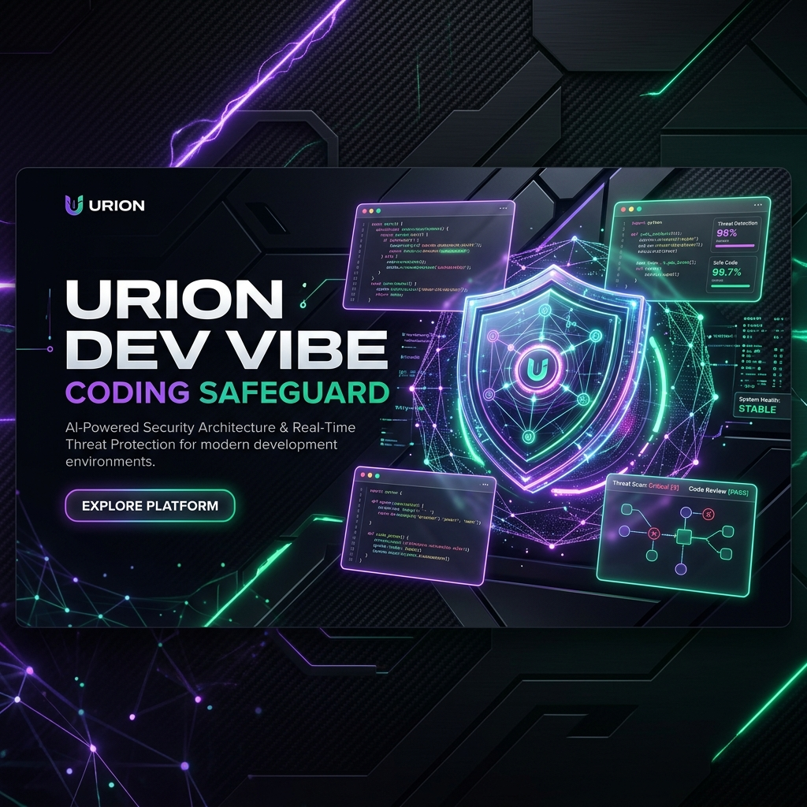
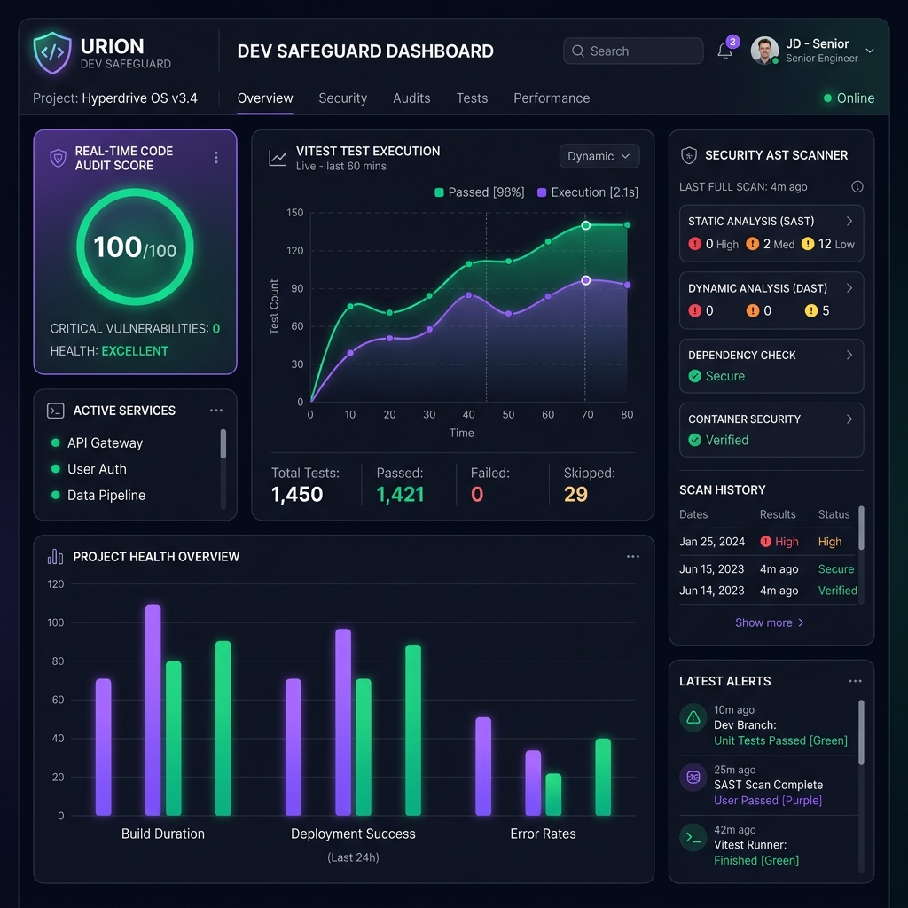

<!-- PROJECT SHIELDS & BADGES -->
<div align="center">

  <a href="https://urion.ia.br">
    
  </a>

  <h1 align="center">🛡️ Urion Dev Vibe Coding Safeguard</h1>

  <p align="center">
    <strong>Desenvolva com IA sem alucinações, débitos técnicos ou colapso arquitetural.</strong>
    <br />
    <a href="https://urion.ia.br"><strong>🚀 Acessar Plataforma & Dashboard Ao Vivo »</strong></a>
    <br />
    <br />
    <a href="#-quick-start-em-30-segundos">Início Rápido</a>
    ·
    <a href="#-exemplos-práticos">Exemplos Práticos</a>
    ·
    <a href="https://github.com/joaoschaun33-cloud/Urion-Dev-Vibe-Coding-Safeguard/issues">Reportar Bug</a>
  </p>

  <!-- README TYPING ANIMATED SVG HEADER -->
  <p align="center">
    <a href="https://urion.ia.br">
      
    </a>
  </p>

  <!-- BADGES -->
  <p align="center">
    <a href="https://github.com/joaoschaun33-cloud/Urion-Dev-Vibe-Coding-Safeguard/actions/workflows/ci.yml">
      
    </a>
    <a href="https://github.com/joaoschaun33-cloud/Urion-Dev-Vibe-Coding-Safeguard/actions/workflows/codeql.yml">
      
    </a>
    <a href="https://opensource.org/licenses/MIT">
      
    </a>
    <a href="https://nodejs.org">
      
    </a>
    <a href="https://react.dev">
      
    </a>
  </p>
</div>

---

<!-- SHOW, DON'T TELL (VISUAL PREVIEW) -->

## 📺 Mostre, Não Conte (Dashboard & Doctor CLI Preview)

> **O problema:** 85% dos projetos criados apenas com prompts de IA (Cursor, Antigravity, Windsurf, Copilot) colapsam no 2º mês por falta de arquitetura e segredos expostos.

<div align="center">
  <a href="https://urion.ia.br">
    
  </a>
  <p align="center" style="margin-top: 8px;">
    <sub>💡 <i>Acesse a plataforma em <a href="https://urion.ia.br">urion.ia.br</a> para interagir com o Dashboard e o Live Audit Playground em tempo real no browser.</i></sub>
  </p>
</div>

---

## ⚡ Quick Start em 30 Segundos

Inicialize um novo projeto 100% blindado com um único comando:

```bash
npx create-vibe-safeguard meu-novo-app
```

Ou rode o repositório localmente em 3 passos simples:

```bash
# 1. Clonar o repositório oficial
git clone https://github.com/joaoschaun33-cloud/Urion-Dev-Vibe-Coding-Safeguard.git && cd Urion-Dev-Vibe-Coding-Safeguard

# 2. Iniciar banco de dados e dependências
docker-compose up -d && npm install

# 3. Executar o Doctor CLI e o Dashboard Web
npm run doctor:cli
npm run dev:web
```

- 🌐 **Dashboard Web**: http://localhost:5173
- 🔌 **API REST Backend**: http://localhost:3000/api/v1/health

---

## 🧪 Exemplos Práticos (Básico ao Avançado)

### 1. Nível Básico: Gerar uma Nova Feature Isolada (FSD)

Em vez de deixar a IA misturar rotas com banco de dados, use o scaffold CLI:

```bash
npm run generate:feature checkout
```

_Gera automaticamente as camadas isoladas: `domain`, `application`, `infrastructure` e `presentation`._

### 2. Nível Intermediário: Auditoria AST Estática Instantânea

Detecte vazamentos de segredos e `console.log` residuais em 1 segundo:

```bash
npm run cursor-doctor
```

### 3. Nível Avançado: Garantia do Dogma Zero na CI/CD

Impeça que a IA envie código com testes falsos ou sem evidências no GitHub:

```bash
git add .
git commit -m "feat(auth): implementar autenticação FSD"
# A CI/CD bloqueia o PR automaticamente se a prova do Vitest não for gerada em .urion/
```

---

## 🛡️ Os 3 Pilares do Urion Safeguard

| Pilar                                | Como Protege Seu Projeto                                                                               |
| :----------------------------------- | :----------------------------------------------------------------------------------------------------- |
| **1. Dogma Zero (`AGENTS.md`)**      | Obriga a IA a ser 100% honesta. Bloqueia PRs se a IA alegar que "os testes passaram" sem gerar provas. |
| **2. Feature-Sliced Design (FSD)**   | Impede importações cruzadas entre funcionalidades. `features/auth` nunca importa `features/payment`.   |
| **3. Spec-Driven Development (SDD)** | Conecta especificações em `00-context/prd.md` ao código via tags `@implements US-*`.                   |

---

## 🤝 Como Contribuir

Contribuições são o que tornam a comunidade open source um lugar incrível!

1. Faça um Fork do projeto (`git checkout -b feature/IncrivelFeature`)
2. Commit suas alterações (`git commit -m 'feat: adicionar IncrivelFeature'`)
3. Push para a branch (`git push origin feature/IncrivelFeature`)
4. Abra um **Pull Request**

---

## 📄 Licença e Autor

Distribuído sob a Licença MIT. Veja `LICENSE` para mais informações.

Criado e Mantido por **[João Schaun](https://github.com/joaoschaun33-cloud)**.

- 🌐 Site Oficial: **[urion.ia.br](https://urion.ia.br)**
- 📧 Contato: `joaoschaun@gmail.com`
