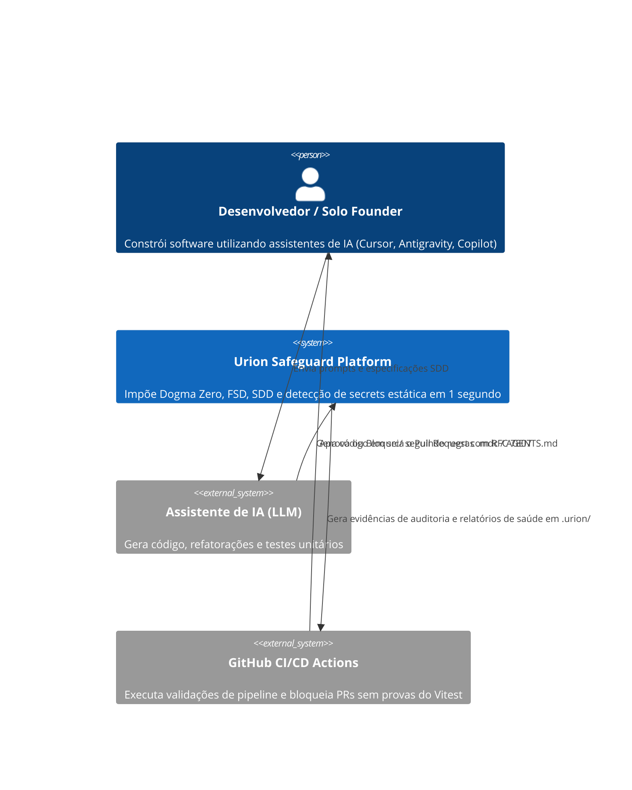
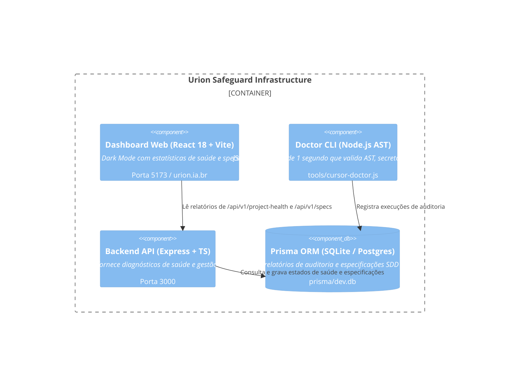

# 🏗️ Arquitetura do Sistema — Urion Dev Vibe Coding Safeguard

> **Modelo C4 + STRIDE Threat Model + Regras de Rastreabilidade SDD**

---

## 1. C4 Model

### Nível 1: Contexto de Sistema

---

### Nível 2: Container (Visão da Plataforma)

---

## 2. Threat Model (STRIDE Framework)

| Categoria | Ameaça Identificada | Mitigação no Urion Safeguard |
| :--- | :--- | :--- |
| **Spoofing** | IA inventa que testes rodaram e passaram sem executá-los. | **Dogma Zero**: Exige log de saída e cobertura real do Vitest antes do merge. |
| **Tampering** | Injeção de código malicioso via Markdown/PRD externo. | **Tratamento Passivo**: Prompt Injections em docs são isolados e desarmados. |
| **Repudiation** | Desenvolvedor alega que "foi a IA que quebrou a produção". | **Spec-Driven Traceability**: Tags `@implements US-*` conectam o autor ao commit. |
| **Information Disclosure** | Hardcoding de API Keys, JWT Tokens ou `.env` em `src/`. | **Doctor AST Scanner**: Bloqueia segredos em menos de 1 segundo via AST. |
| **Denial of Service** | Alucinação criando loops N+1 ou arquivos gigantes (>300 linhas). | **Linter de Arquiteturas FSD**: Limita arquivos a 300 linhas max. |
| **Elevation of Privilege** | Importação cruzada ilegal de domínios privados (`features/auth` ↔ `payment`). | **Isolamento FSD**: Módulos de domínio não podem importar infra/apresentação. |

---

## 3. Decisões Arquiteturais Gravadas (ADRs)

- **ADR-001: Dogma Zero de Honestidade Absoluta**: A IA nunca pode inventar status de teste ou omitir erros.
- **ADR-002: Adotação Estrita de Feature-Sliced Design (FSD)**: Organização em `domain`, `application`, `infrastructure`, `presentation`.
- **ADR-003: Validação Estática sem Sobrecarga de Runtime**: AST rápido via Node.js local sem dependências de serviços externos.
