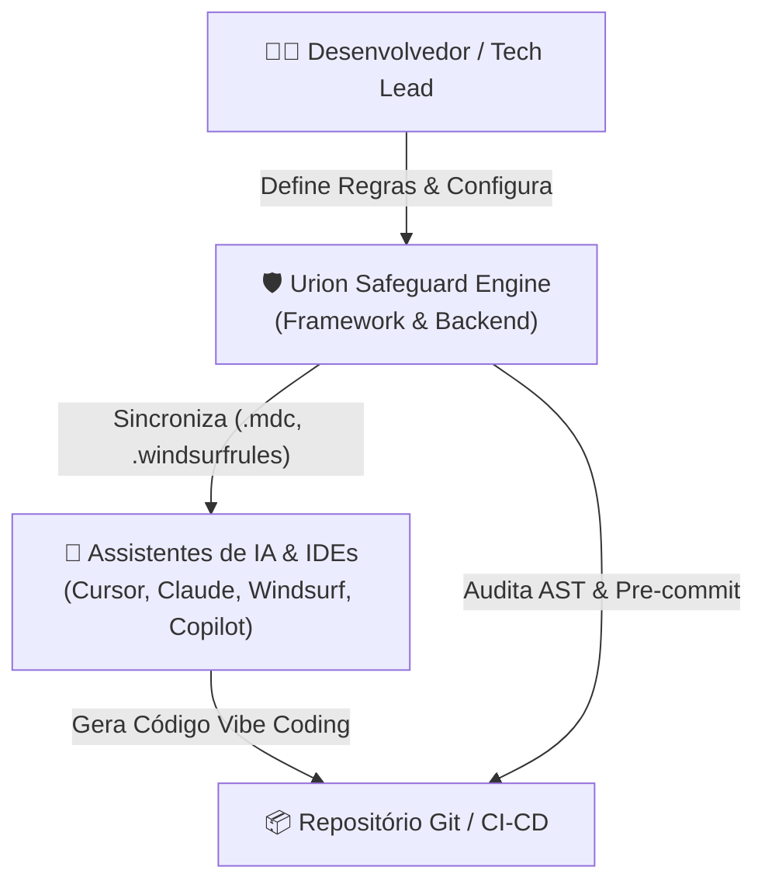
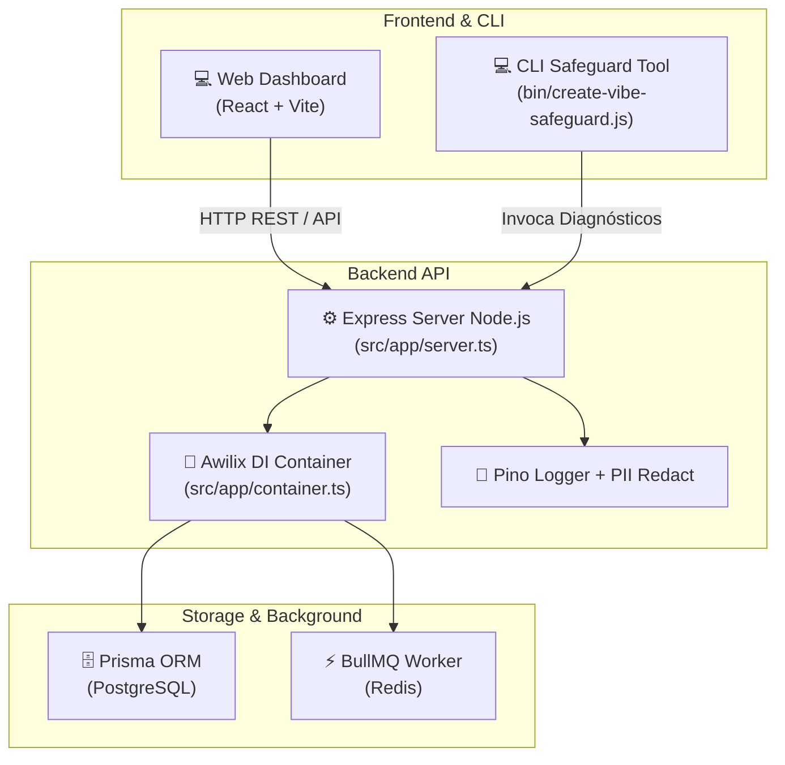

# 🏛️ Arquitetura do Sistema — C4 Model (Level 1, 2 & 3)

Este documento descreve a arquitetura do **Urion Dev Vibe Coding Safeguard** utilizando a especificação **C4 Model** com diagramas Mermaid.

---

## 1. Nível 1: Diagrama de Contexto de Sistema (Context Diagram)

O diagrama abaixo ilustra como o ecossistema Urion se posiciona entre os desenvolvedores, IDEs assistidas por IA e repositórios de código.



---

## 2. Nível 2: Diagrama de Contêineres (Container Diagram)

O diagrama abaixo detalha os contêineres internos e adaptadores do sistema.



---

## 3. Nível 3: Diagrama de Componentes por Feature (Component Diagram - FSD)

Estrutura interna das **Features FSD** (`src/features/`):

```mermaid
graph LR
    subgraph Feature Layer (FSD)
        Controller["Presentation Layer<br/>(Express Controller + Zod)"]
        UseCase["Application Layer<br/>(Use Case / Domain Logic)"]
        Domain["Domain Layer<br/>(Entity + Repository Interface)"]
        Infra["Infrastructure Layer<br/>(Prisma Repository Adapter)"]
    end

    Controller --> UseCase
    UseCase --> Domain
    Infra -.->|Implementa| Domain
    Awilix["Awilix Container"] -.->|Injeta| Infra
```

---

## 🔒 Princípios de Segurança C4

1. **Zero Trust em Inputs**: Toda requisição passa por schemas rigorosos Zod antes de atingir os Use Cases.
2. **Correlation ID Everywhere**: `X-Request-ID` rastreado ponta a ponta.
3. **Persistência ACID**: Transações seguras com PostgreSQL via Prisma.
